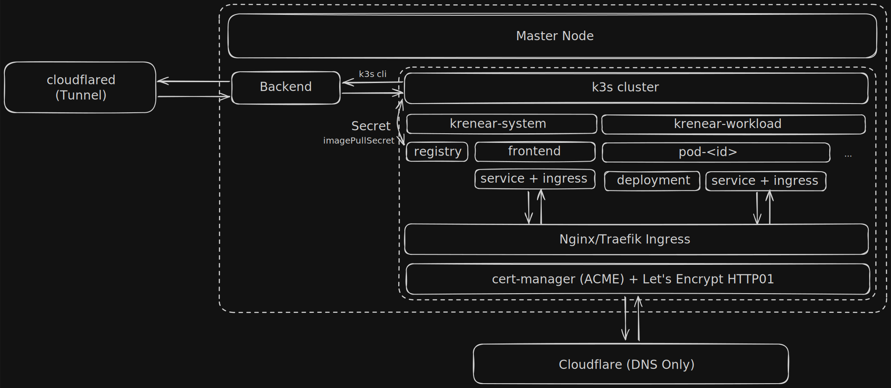

# Krenear-Archive

Bu proje 11. sınıf başında yaptığım daha çok PoC tarzında olan bir k3s deployment projesidir. Erken dönemlerde yaptığımdan dolayı kod kalitesinde ve kullanıcı deneyiminde oldukça eksik olucaktır. Bulabildiğim en son ki versiyon budur, ondan sonraki bu versiyonda yarım kalmış, eksik özellikler ve hatalar bulunabilir.

> [!CAUTION]
> Proje deneysel amaçlarla geliştirildi ve 2 senedir maintain edilmemektedir. Bu revizyon sadece monorepoyu kapsamaktadır güvenlik açıkları ve saldırı kapıları mevcut olabilir.

## Yapılan Revizyon
- Ayrı olan repositoryler anlaşılabilirliği daha iyi olması için tek bir monorepo'da birleştirildi.
- Paket yöneticisi yarn v1 yerine bun olarak değiştirildi.
- Backend için Hyper-Express modülü Bun runtime ile uygun olması için Express.js ile değiştirildi.

## Özellikler
- Tek-tıkla deployment kurulumu
- Basit CMS
- Basit kullanıcı arayüzü
- Özel domain ekleme

## Gelecekten Notlar
- k3s ile CLI üzerinden iletişim sağlanıyor, bunu `@kubernetes/client-node` paketi üzerinden daha iyi yapabiliriz.
- Frontend tarafında framework özellikleri çoğunlukla kullanılmıyor.
- Frontend tarafında Arayüz Componentlerinin çoğunun yazımı yanlış.
- JWT Invalidation yok.
- JWT Renew yok.
- Validation kütüphanesi kullanılmıyor, yazılan validation modülü sadece veri tipi doğrulaması yapıyor. Zod, Valibot veya Typebox gibi bir doğrulama kütüphanesinin kullanılması daha iyi olucaktır.
- Kullanıcılar için bir dokümentasyon yok.
- Deployment oluşturma sadece hazır imajları barındırıyor, kullanıcıların kendi imajlarını yüklemesi için Manifest ve Dockerfile tabanlı bir build sistemi eklenebilir.
- Oluşturulan deploymentların metricleri, replikaları kullanıcıya gösterilmiyor.
- Sistemin deployment yerine pod üzerinden yürümesi gerek.

## Sistem Tasarımı


## Geliştirme

```bash
# Bağımlılıkların kurulumu
bun install

# ".env.example" dosyasını ".env" olarak yeniden adlandırıp içindeki değişkenleri ayarlayın
# Prisma client'in oluşturulduğundan ve schemanın yüklendiğinden emin olun
bun run database:generate
bun run database:push

# Backend için
bun run backend:dev # k3s yüklü değilse --nok3s argümanını kullanın

# Frontend için
bun run frontend:dev
```

## Production

Production dosyaları `/dist` klasörlerinin içerisinde olacağından node veya bun runtime ile özgürce çalıştırılabilirler. Frontend içinse build aşamasının ardından Docker build kullanılarak container halinde çalıştırılabilir. Mimarinin erken dönemlerinde k3s clusterının içinde çalıştırılması amaçlanmıştır.

```bash
# Backend için
bun run backend:build

# Frontend için
bun run frontend:build
```